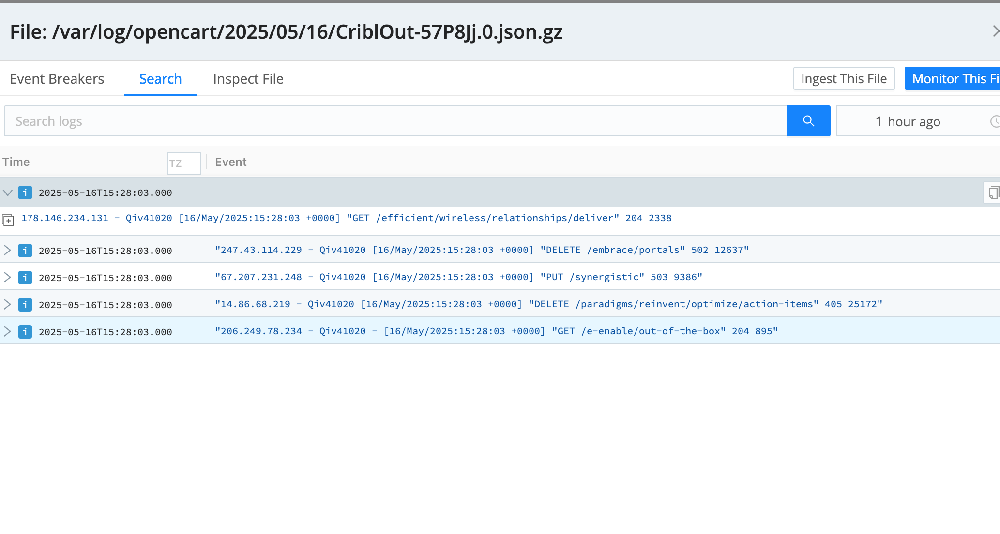

# Cribl SE Lab Walkthrough

This repository contains the Cribl SE lab, which allows you hands on experience with Cribl Stream and Edge tools.

Each section of the lab allows you to exercise a different functionality within the Cribl Stream and Edge products, using a containerized homelab setup that mimic's a real world productions environment of a typical web facing ecommerce application.

For each Lab Module, a summary and screenshots of what's accomplished are provided to show how a successful configuration might appear.

The specific instr

## Exercise One - Environment Setup

In this Exercise, we setup the basic repository structure, which is merely a docker-compose.yml file and a .env file which contains the various environment variables used to provision the containers in the network. The containers included a mock web-app, it's sql compatible db, a cribl worker + edge container, and a minio container, which allows us to mimic cloud object storage like s3. It also provisions a docker network (`criblcandidatenetwork`) for easier connections btwn the various other containers. The created  [.env](.env) and [docker-compose](docker-compose.yaml) files can be found in this repository. (_please note that the .env file contains sensitive information so please do not commit it into version control_)

Once the docker containers are started (`docker compose up` to start, and `docker-compose down` to remove), it's straightforward to visit the exposed port for the minio object storage container, login, and create a default bucket. Screenshots of this can be seen below

## Exercise Two - Cribl Edge - Initial setup and configuration

Next, we setup the initial configuration for the Edge container. First, ensure you've created a cribl cloud acct per the Lab instructions, and then generate a custom curl command for installing the edge node onto the local edge container. Following the lab instructions should yield a bash script to be copied (and then run in the container directly by `exec`'ing into it and cd'ing to the `/opt` directory), as seen in this screenshot

Then, once edge is installed on the container, back in the cribl UI we configure edge, via it's sources, pipelines, and destinations. In this exercise we're focusing on just the Sources. So, first we removed unused sources (such as windows events, system metrics, etc), and then we add a syslog source per the instructions in the lab. Since we don't have a destination or pipeline setup yet, we simply use the quickconnect UI to connect to the devnull destination. Screenshots of this configuration can be seen below. Lastly we ensure we have a remote connection established btwn the cribl UI and our local edge instance, by invoking the "capture" option for the syslog datasource in question. This source will pickup application logs from our ecomm web-app, and allow us to create a sample file of these logs which we can then leverage to test and configure our pipeline transformations and filtering functions.

_Note: ensure you're not managing this configuration via the specific GUID's [Teleport Into Edge Node](https://docs.cribl.io/edge/managing-edge-nodes/#teleport-into-an-edge-node)functionality, as this can be overwritten when making changes later to the Leader._

## Exercise Three - Event Parsing and Enrichment

Now, which a Source and connection btwn an Edge Node and Leader established, we can setup the Middle step, a "Pipeline" which allows us to parse the received events from the source, enrich them, filter them, and transform them into desired formats. First, we create a custom lookup table as a csv file, used for translating http status codes into their description and type (ie, 404 => Not Found, Error), using the ["Lookup"](https://docs.cribl.io/stream/using-lookups/) feature.

Then, which a Lookup file defined, we can create our Pipeline. Our pipeline (OpenCart) will be able to leverage that sample capture file we generated in the previous step to verify it's working as expected. To our pipeline we add three functions, a [Regex Extract](https://docs.cribl.io/stream/regex-extract-function/)(execute regex on events raw text to extract specific actionable http request/response details as named capture groups), a [Lookup](https://docs.cribl.io/stream/lookup-function/)(map event values to what's in the lookup table), and an [Eval](https://docs.cribl.io/stream/eval-function/)(effectively custom js expressions). The Three functions we add to the pipeline should look like the below screenshots

Now we have specific fields for most relevant http request details, such as http url or status code, allowing us to later slice and dice by these details in later exercises.

## Exercise Four - Event Transformation & Optimization

While being able to modify events with powerful filters and transforms is useful, we also will need to serialize these events into specific wire compatible formats that can be sent to our destinations via their natively accepted standards. In this case, we'll add a [Serialize](https://docs.cribl.io/stream/serialize-function/#serialize) function to the end of our pipeline, allowing us to serialize these events into json which we can them emit to various destinations. In this function, we configure both the fields we do and do not want to include in our final payload, and the final result should look like the screenshot below

## Exercise Five - Configuring Edge Destinations

We've now setup both a Source and a Pipeline, but the destination is still just devnull (effectively blackholing the output). In this Exercise we setup a destination. First we add a Filesystem destination specific to the Edge node where this pipeline is being run. We add a new destination ([Filesystem](https://docs.cribl.io/stream/destinations-fs/)), configure the directory path where we want to write our output files of serialized JSON to, and define some configuration options around handling backpressure etc. Then, Cribl allows us to validate via a Test, which ensures that data is making it to both the staging (unaggregated) and final file location destinations. Also, Cribl allows us to remotely explore the Edge Node filesystems and verify the contents of the log files are in line with our expectations. Both these functionalities can be seen in the screenshots below.

## Exercise Six - Connecting Sources to Destinations 

In this exercise we'll being to put all the pieces together by connection our syslog source to our filesystem destination. Via the UI we can connect the source to destination via Drag N' Drop ClickOps in [QuickConnect](https://docs.cribl.io/stream/quickconnect/), and also ensure the OpenCart pipeline and it's various processing functionality (defined in previous sections) can be added onto this connection. Also we the purposes of this SE Exercise we add another destination, tcp_json, which emits the serialized json payloads over tcp to a remote server, in this case the cribl mgmt's teams server so they can verify the results of this exercise for the SE. We can these easily verify that the compressed json payloads are being saved to the appropriate location on the edge node filesystem. The screenshots below should be similar to how this is setup for your specific use case

## Exercise Seven - Edge Monitoring

Crible Edge also comes with some useful monitoring and observability tools OOTB. They provided easy auto-magic dashboards which allow you to verify that your Edge node is receiving and processing event traffic. You can verify this like in the below screenshot of the [event monitoring overview](https://docs.cribl.io/stream/monitoring/), which has high level graphs showing event and bytes traffic rates.

## Exericse Eight - Cribl Search

Now we have an entire pipeline setup. We receive raw application syslog style logs from a webapp, we transform them into a more managable and human readable JSON format with specific fields for specific http attributes, we enrich them with our own metadata, and we emit them to a local filesystem as well as over tcp to a remote server. Next, in this exercise, we'll now leverage that formatting and normalization to search and visualize our events.

First, we create a dataset for opencart filesystem logs following the instructions in the lab, configuring which edge fleets to query, at what filesystem locations, for which types of files.

Second, we modify the processing setting to point the _raw field on the events for that dataset.

Third, we perform a basic search using the Cribl Search functionality, which allows a central remote UI from which we can search across all our disparate edge nodes. [Search](https://docs.cribl.io/search/about/)

Next, we try different searches using the search DSL operators and functions, searching with a limit, searching with a send function to emit the results to a remote server, and searching with various types of data extraction builtin such as JSON, regex named capture, or even our own parsers, which we can configure via the Parsers settings. Screenshots of all this functionality can be seen below.

Last, we use different [Search Types](https://docs.cribl.io/search/basic-concepts/#aggregate) to summarize our results into "Chartable" values, and create basic timeseries visualizations, as well as bespoke dashboards and custom viz such as the "Donut" Visualization. This functionality can be seen in the screenshots below.

